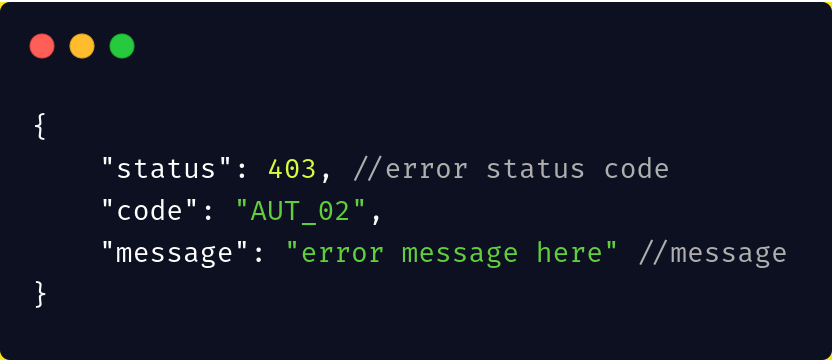

# LaraStart

## Table of contents
* [API Respones](#api-responses)
* [Exception Traits](#exceptionstrait)
* [Auth Service](#authservice)

## Installation
```sh
composer require innoflash/larastart
```

## Usage

### #API Responses
This used for manipulating API JSON responses for ```success/fail``` calls

* You can simply use for like:

```php
<?php

use InnoFlash\LaraStart\Traits\APIResponses;

class ClassName
{
    use APIResponses;
```

* Usage on all your controllers

```php
<?php

namespace App\Http\Controllers;

use InnoFlash\LaraStart\Traits\APIResponses;
...

class Controller extends BaseController
{
    use AuthorizesRequests, DispatchesJobs, ValidatesRequests;
    use APIResponses;
}
```

#### Calling the functions
```php
$this->successMessege('{optional :message here}')
```

and this gets you a response with status 200


### ExceptionsTrait
This is to override Laravel error logging do that we sent all type of errors to our API clients

* You can simply set it up by using the ExceptionsTrait in your ```Exceptions\Handler class```

```php
<?php

namespace App\Exceptions;

use Exception;
use InnoFlash\LaraStart\Traits\ExceptionsTrait;
use Illuminate\Foundation\Exceptions\Handler as ExceptionHandler;

class Handler extends ExceptionHandler
{
    use ExceptionsTrait;
```

* Now override the render function

```php
    public function render($request, Exception $exception)
    {
        return $this->apiExceptions($request, $exception);
    }
```

* This overrides all errors and format 



If you want the default error rendering 
```php
return $this->apiExceptions($request, $exception, true); //true triggers the default error
```

### #AuthService
* This one helps handle logging in and fetching the user access token. 
* Works really well with [Laravel Passport](https://laravel.com/docs/passport)

#### SETUP
In the ```.env``` file you will need to add these clients

```.env
CLIENT_ID={client_id}
CLIENT_SECRET={client_secret}
```

Then in your ```AuthenticationController``` you will need to inject the ```AuthService``` class in it

```php
use InnoFlash\LaraStart\Services\AuthService;

class AuthController extends Controller
{
    private $authService;
    public function __construct(AuthService $authService)
    {
        $this->authService = $authService;
    }
```

#### USAGE
* This is how simple you will call when you need the our desired results
* You can make the same call if you want login the user after registering

```php
    function login(LoginRequest $request)
    {
        return $this->authService->attemptLogin();
    }
```

#### OUTPUT

```JSON
{
    "user": {
        "id": id,
        "first_name": first_name,
        "last_name": last_name,
        "email": email,
        "email_verified_at": _date_
    },
    "token": {
        "access_token": ~access token~,
        "expires_in": expires_in
    }
}
```

#### CUSTOMIZATION
If you want to customize the the results you need to publish the config file

```php
php artisan vendor:publish --tag=larastart-config
```
and this copies the ```larastart.php``` into you config folder

* Edit the file to suit your needs

```php
return [
    /**
     * Replace this login resource with your own if you have it
     */
    'resource' => \InnoFlash\LaraStart\Http\Resources\User::class,

    /**
     * Sets the default limit for paginated items
     */
    'limit' => 15,

    /**
     * Sets the default guard you want to use in the auth service
     */
    'guard' => 'web'
];
```