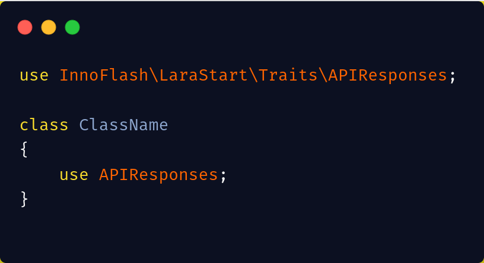
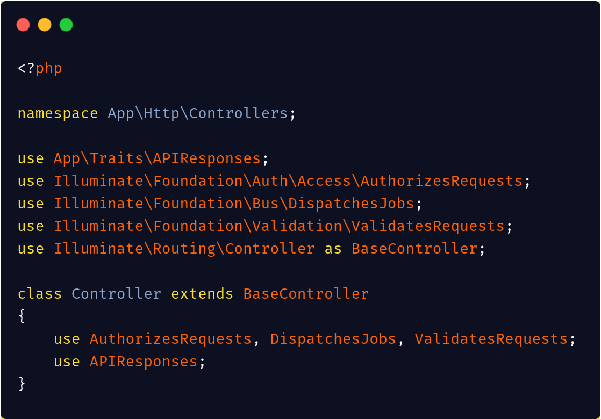
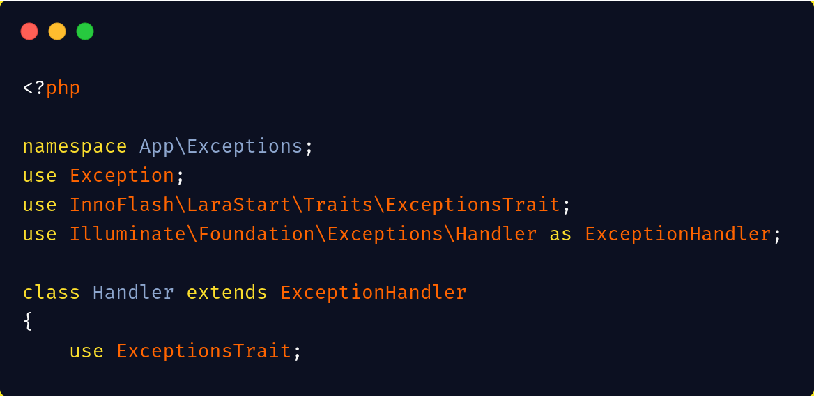
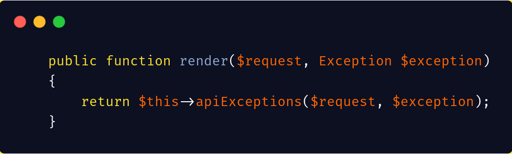

# LaraStart

## Installation
```sh
composer require innoflash/larastart
```

## Usage

### API Responses
This used for manipulating API JSON responses for ```success/fail``` calls

* You can simply use for like:



* Usage on all your controllers



#### Calling the functions
```php
$this->successMessege('{optional :message here}')
```

and this gets you a response with status 200


### ExceptionsTrait
This is to override Laravel error logging do that we sent all type of errors to our API clients

* You can simply set it up by using the ExceptionsTrait in your ```Exceptions\Handler class```



* Now override the render function



* This overrides all errors and format 


If you want the default error rendering 
```php
return $this->apiExceptions($request, $exception, true); //true triggers the default error
```