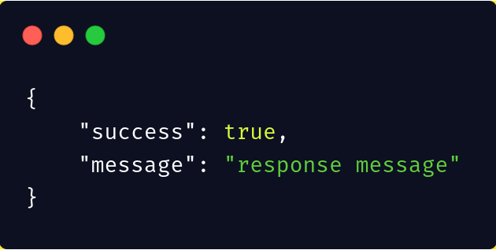

# LaraStart
[](https://packagist.org/packages/innoflash/larastart)
[](https://travis-ci.org/innoflash/laravel-self-test)
[](https://scrutinizer-ci.com/g/innoflash/larastart)
[](https://packagist.org/packages/innoflash/larastart)
[](https://packagist.org/packages/innoflash/larastart)
[](LICENSE.md)

## Table of contents
* [API Responses](#api-responses)
* [Exception Traits](#exceptionstrait)
* [Auth Service](#authservice)
* [CRUD Services](#crud-service)

## Installation
```sh
composer require innoflash/larastart
```

# Usage

## #API Responses
This used for manipulating API JSON responses for ```success/fail``` calls

* You can simply use for like:

```php
<?php

use InnoFlash\LaraStart\Traits\APIResponses;

class ClassName
{
    use APIResponses;
```

* Usage on all your controllers

```php
<?php

namespace App\Http\Controllers;

use InnoFlash\LaraStart\Traits\APIResponses;
...

class Controller extends BaseController
{
    use AuthorizesRequests, DispatchesJobs, ValidatesRequests;
    use APIResponses;
}
```

#### Calling the functions
```php
$this->successMessege('{optional :message here}')
```

and this gets you a response with status 200




## ExceptionsTrait
This is to override Laravel error logging do that we sent all type of errors to our API clients

* You can simply set it up by using the ExceptionsTrait in your ```Exceptions\Handler class```

```php
<?php

namespace App\Exceptions;

use Exception;
use InnoFlash\LaraStart\Traits\ExceptionsTrait;
use Illuminate\Foundation\Exceptions\Handler as ExceptionHandler;

class Handler extends ExceptionHandler
{
    use ExceptionsTrait;
```

* Now override the render function

```php
    public function render($request, Exception $exception)
    {
        return $this->apiExceptions($request, $exception);
    }
```

* This overrides all errors and format
```json
{
    "class": "Illuminate\\Validation\\ValidationException", //error class
    "statusCode": 422,   //error status code
    "message": "The password field is required." //error message
}
```

If you want the default error rendering
```php
return $this->apiExceptions($request, $exception, true); //true triggers the default error
```

### #AuthService
* This one helps handle logging in and fetching the user access token.
* Works really well with [Laravel Passport](https://laravel.com/docs/passport)

#### SETUP
In the ```.env``` file you will need to add JWT secret key.
Run the command below to get the key into your ```.env``` file

```sh
php artisan jwt:secret
```

By default JWT tokens live for 60 minutes so if you want to alter the lifespan add the following in the ```.env``` file
```env
JWT_TTL => time_in_minutes
```


Then in your ```AuthenticationController``` you will need to inject the ```AuthService``` class in it

```php
use InnoFlash\LaraStart\Services\AuthService;

class AuthController extends Controller
{
    private $authService;
    public function __construct(AuthService $authService)
    {
        $this->authService = $authService;
    }
```

#### USAGE
* This is how simple you will call when you need the our desired results
* You can make the same call if you want login the user after registering

```php
    function login(LoginRequest $request)
    {
        return $this->authService->attemptLogin();
    }
```
If you are using multi-auth you will need to pass the guard you are using for authentication
```php
function login(LoginRequest $request)
    {
        return $this->authService->attemptLogin([], 'your-guard);
    }
```
#### OUTPUT

```JSON
{
    "user": {
        "id": 1,
        "first_name": "first_name",
        "last_name": "last_name",
        "email": "email",
        "email_verified_at": "_date_"
    },
    "token": {
        "access_token": "~access token~",
        "expires_in": "expires_in",
        "type": "bearer"
    }
}
```

#### CUSTOMIZATION
If you want to customize the the results you need to publish the config file

```php
php artisan vendor:publish --tag=larastart-config
```
and this copies the ```larastart.php``` into you config folder

* Edit the file to suit your needs

```php
return [
    /**
     * Replace this login resource with your own if you have it
     */
    'resource' => \InnoFlash\LaraStart\Http\Resources\User::class,

    /**
     * Sets the default limit for paginated items
     */
    'limit' => 15,

    /**
     * Sets the default guard you want to use in the auth service
     */
    'guard' => 'api'
];
```

## CRUD Service
This is meant to simplify the most CRUD operations and its best done by generating some service classes in the ```app/Services``` directory.
The services handle basic
* Create
* Update
* Delete
* Select

#### SETUP
Just create run an artisan command to create the ```ServiceClass``` and customize all you want if the boilder plate is not sufficient for you

```sh
php artisan make:service {ServiceName} --model={ModelName}
```

* Almost done, you now need to inject your service class into the controller as follows

```php
class ModelController extends Controller
{
    private $modelService;
    function __construct(ModelService $modelService)
    {
        $this->modelService = $modelService;
    }
```

* If you are going to use the ```ModelService``` in more than one class ie. the controller (and you wanna use it in requests and resources and wherever) you will have to add the ```ModelService``` into the ```AppServiceProvider``` as a singleton so that the app does not have rerun querying the model

```php
//your app/Providers/AppServiceProvider.php

public function register()
{
    $this->app->singleton(ModelService::class, ModelService::class);
}
```

Good to go, now let`s see how to run crud functions here

##### SELECT QUERY
```php
    /**
     * How to get the selected model
     */
    return $this->modelService->getModel();

    /**
     * Query for multiple results
     *
     * You are still open to run default model query like
     */
    return Model::all();

     /**
     * but since the service is can inject the model into the
     * request we can run it as
     */
    return $this->modelService->getModel()->all();
```

##### DELETE QUERY
```php
public function delete(DeleteRequest $request)
{
    /**
     * Since the service is injected into the controller it
     * knows exactly what model to target so calling destroy
     * automates a precise delete
     *
     * You can pass a custom delete message or leave as is
     */
    return $this->modelService->destroy('custom delete message');
}
````

##### UPDATE QUERY
```php
public function update(UpdateRequest $request)
{
    /**
     * You just have to sent the right model id and the
     * service finds the model and updates the model
     *
     * $params is highly likely to be the validated input
     *
     * You can override the update success message by adding
     * a message param as a second param
     * return {
     *              success: true,
     *              message: 'model updated'
     *        }
     */
    return $this->modelService->update($params);
}
```
##### CREATE QUERY
```php
public function create(CreateRequest $request)
{
    /**
     * the create method takes an array for params so we are just gonna
     * set the validated values from our request
     *
     * This return the a default response
     * {
     *      success: true,
     *      message: "model created"
     * }
     */
    return $this->modelService->create($request->validated());

    /**
     * You can override the output message by passing a second parameter
     */
    return $this->modelService->create($request->validated(), 'custom message');

    /**
     * If you want to get the created object you must add another boolean param and set it to true to get the object
     * This returns the object as is
     */
        return $this->modelService->create($request->validated(), 'custom message', true);
}
```

##### SPECIAL CREATE QUERY
Oftenly we would wanna create models based on a model they belong to. You will need to override the ```getParentRelationship()``` in the ```ModelService::class``` (overriding the CRUDService class method)

```php
/**
     * Attaches a parent to the current model
     */
    function getParentRelationship()
    {
        /**
         * For example you want to create a comment for a post
         * You will need to initialize the post($parentObject)
         *  and call the relationship it has to the current model(relationshipToModel)
         */
        return [
            ParentModel::class, //parent model of the model to be created
            'relationshipName', //relationship name in parent model
            'foreign_key', //OPTIONAL fK in new model or default is used
        ];

        /**
         * Mainly i have been using to attach a relationship to the
         * authenticated user
         * If you already have the parent object call the relationship
         * for this as shown in the example below
         */
        return auth('guard')->user()->relationshipToModel();
    }
```
When the service is setup now you can do the create function

```php
    public function create(CreateRequest $request)
    {
        //where $params is the validated input
        return $this->taskService->createFromParent($params, 'Task created!');
    }
```
